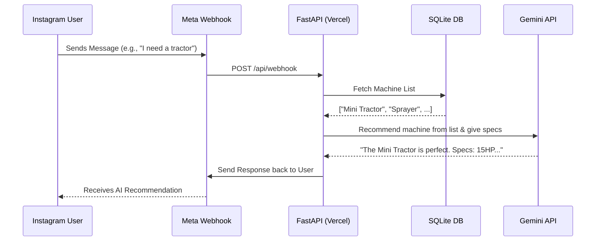

# Gupta Traders EA - Intelligent Instagram Bot

This project is a fully automated, AI-powered chatbot for **Gupta Traders**. It interprets customer messages from Instagram, recommends agricultural machinery from a catalog, and provides technical specifications using the latest Gemini API.

## 🚀 Goal
To create a 100% free, always-on server that:
1. Receives Instagram Direct Messages.
2. Uses **Gemini 2.5 Flash** to understand customer needs.
3. Matches needs against an internal SQLite database of machine names.
4. Generates professional responses (English/Hindi/Hinglish) with machine specs.
5. Deploys to **Vercel** to avoid server "sleep" issues.

## 🛠 Tech Stack (100% Free Tier)
- **Framework**: [FastAPI](https://fastapi.tiangolo.com/) - High performance, asynchronous Python framework.
- **AI Engine**: [Google Gemini 2.5 Flash](https://aistudio.google.com/) - Latest, fastest model optimized for low token usage.
- **Database**: **SQLite** - Lightweight, file-based database (stored in `/tmp` for Vercel execution).
- **Deployment**: [Vercel](https://vercel.com/) - Serverless hosting (no sleep cycles like Render).
- **Messaging**: [Instagram Graph API](https://developers.facebook.com/docs/instagram-api) - Part of Meta for Business.

## 📊 Data Flow


## 📂 Project Structure
- `api/index.py`: Main entry point and Webhook logic.
- `api/database.py`: SQLite schema and SQLAlchemy models.
- `api/gemini_service.py`: Interaction with Google AI Studio.
- `api/meta_service.py`: Instagram message delivery logic.
- `seed.py`: Initial setup script to populate the machine catalog.
- `vercel.json`: Deployment configuration for Vercel.

## ⚙️ Setup Instructions
1. **Clone & Install**:
   ```bash
   pip install -r requirements.txt
   ```
2. **Environment Variables**:
   Create a `.env` file with:
   - `GEMINI_API_KEY`: Your Google AI Studio key.
   - `META_ACCESS_TOKEN`: Your Instagram Page Access Token.
   - `META_VERIFY_TOKEN`: A secret string you choose for webhook verification.
3. **Initialize Database**:
   ```bash
   python seed.py
   ```
4. **Deploy**:
   Push to GitHub and connect your repository to Vercel.

## 💡 Optimization for Free Tier
- **Token Efficiency**: We only pass machine *names* to Gemini. It uses its internal knowledge for specs, saving us from storing large text in the DB and reducing prompt size.
- **State Management**: Only the last few messages are stored in history to keep Gemini prompts small and fast.
- **Vercel Hosting**: By using Vercel, we ensure the bot is "always awake" when a webhook hits, unlike Render which sleeps after inactivity.
